# H4Graph — Paper Knowledge Graph Platform — Detailed Design

**Domain:** AI · **Shape:** Service (modular monolith) · **Date:** 2026-07-03

A subscription service where LLM agents ingest research papers into a knowledge graph and answer questions over it, combining semantic (vector) retrieval with graph-relationship traversal.

## Product identity

**H4Graph** — decode: **H**ybrid **4**-layer answering over a knowledge **Graph**. The four layers are the answering architecture itself (§6.2): relational (PostgreSQL), graph (Neo4j), vector (Qdrant), and the agent synthesis layer on top. Nickname: **H4** ("aitch-four"). Named in the tradition of infrastructure that says what it does — PostgreSQL, Uber's H3 — with the decode documented here so it never becomes folklore.

| Asset | Value |
|---|---|
| Domains | h4graph.com (global) · h4graph.com.au (anchors the AU data-residency story, §8) |
| API namespace | `api.h4graph.com/api/v1` · SDKs published as `h4graph` (npm/PyPI/Maven) |
| Anticipated FAQ | "Related to Uber H3?" — no; H3 is hexagonal geospatial indexing. State it in the docs FAQ once, preempt it forever |
| Open-source option | The graph/retrieval engine can later ship standalone under the H4 name (the H3 playbook: the library markets the platform) |
| To do | Register both domains immediately; formal trademark clearance (AU/US/EU) before public launch |

---

## 1. Problem Statement & Requirements

Agents ingest papers into a knowledge graph and answer over it, using both semantic similarity search and graph retrieval. Access is monetized through subscriptions.

| Driver | Design response |
|---|---|
| knowledge-graph, graph-relationships | Neo4j as fit-for-purpose graph store |
| similarity-search | Qdrant vector store + `text-embedding-3` embeddings |
| llm-agent-orchestration | Embabel Agent (GOAP planning + OODA replanning) on Spring AI |
| request-response, spa-frontend | REST/JSON API + React (TypeScript) SPA, BFF pattern |
| payments | Stripe |
| authentication | Auth0 (OAuth2/OIDC), JWT sessions, API keys for 3rd parties |
| integration-testing | Testcontainers over real PostgreSQL/Neo4j/Qdrant |

**Constraints (non-negotiable):** `framework=spring-boot`, `language=java`, `provider=bedrock`.

---

## 2. System Context

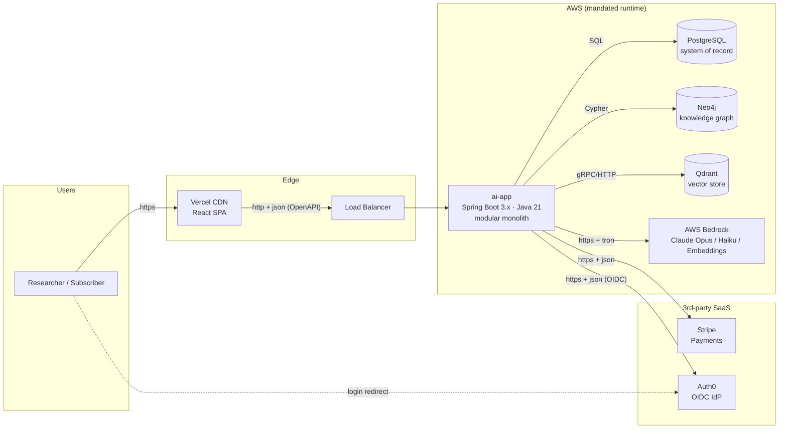

**Key decisions at this level**

- **Modular monolith over microservices:** wins on operability (4>2), simplicity (4>2), testability (4>3) and cost efficiency (5>2); concedes deployability and fault isolation — acceptable at this scale.
- **Polyglot persistence, one store per data role:** PostgreSQL (relational system of record), Neo4j (graph role), Qdrant (vector role). Each is fit-for-purpose rather than forcing one store to fake three roles.
- **Deploy split:** JVM service on AWS; static React assets on Vercel/CDN (edge-cached, not app servers).

---

## 3. Component Topology (Modular Monolith)

Single deployable `ai-app`, Maven multi-module build. Each business capability is a module with a public `api/` and a hidden `internal/` package. Cross-module calls go only through `api/`.

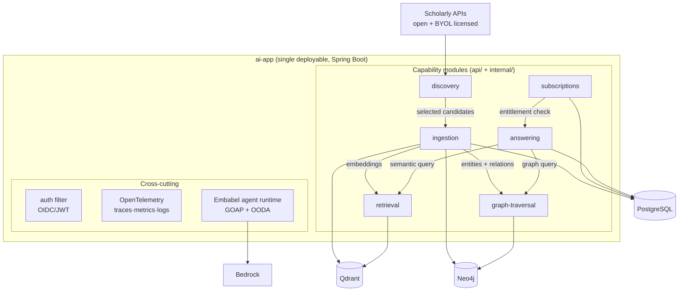

| Module | Responsibility | Stores touched |
|---|---|---|
| `discovery` | Federated paper search over open + BYOL licensed sources, DOI dedupe, rights-checked candidates | PostgreSQL |
| `ingestion` | Parse papers, extract entities/relations via agents, write to all three stores | PostgreSQL, Neo4j, Qdrant |
| `retrieval` | Semantic similarity search over embeddings | Qdrant |
| `graph-traversal` | Relationship queries, multi-hop traversal, citation chains | Neo4j |
| `answering` | Agent-orchestrated Q&A fusing vector + graph context | PostgreSQL (audit), via retrieval/graph-traversal |
| `subscriptions` | Plans, entitlements, Stripe webhooks, usage metering | PostgreSQL |

**Internal structure per module (hexagonal-lite):** `api/` (controllers, DTOs, public service interfaces) → `domain/` (aggregates, ports, services) → `infra/` (JPA/Neo4j/Qdrant adapters).

---

## 4. Technology Stack & Version Pins

| Layer | Choice | Why (vs. peers) |
|---|---|---|
| Backend | Spring Boot 3.x, Java 21 (Temurin) | Mandated framework; 3.x pinned by Embabel (`>=3.5 <4.0`); Java 21 is the LTS ceiling for Boot 3.x; Temurin recommended on cost/support |
| Frontend | React (TypeScript) | SPA driver; deployed to Vercel/CDN |
| Agent framework | **Embabel Agent** (agent-power 33/35) | Beats spring-ai (26), langchain4j (25), koog (24); native Spring Boot integration; GOAP planning + OODA replanning, multi-agent 5/5, observability 5/5 |
| Relational store | PostgreSQL | Beats MySQL on queryPower 5>4, reliability 5>4, flexibility 4>3 (richer types/extensions) |
| Graph store | Neo4j | Fit-for-purpose graph store |
| Vector store | Qdrant | Fit-for-purpose vector store (maturity 5/5) |
| Migrations | Flyway (SQL + Java) | Beats Liquibase on simplicity 5>3; Alembic/golang-migrate/prisma excluded (wrong ecosystem) |
| Payments | Stripe | https + json |
| Auth | Auth0 | OAuth2/OIDC + JWT |
| LLM provider | AWS Bedrock (mandated) | https + tron serialization (beats toon on speed 5>4) |
| Testing | JUnit 5, Mockito, Testcontainers, Pact, WireMock | See §9 |

**Models per task:**

| Task | Model | Rationale |
|---|---|---|
| Reasoning / agents | `claude-opus-4-8` | Strongest reasoning for tool-calling agents |
| High-volume / cheap | `claude-haiku-4-5` | Fast + cheap for simple, frequent calls (classification, extraction triage) |
| Embeddings | `text-embedding-3` | Vectorization for Qdrant (not a chat model) |

---

## 5. Data Architecture

### 5.1 PostgreSQL — system of record

Normalized schema, primary-key access (no special access pattern required by load analysis). Migrated by Flyway; the schema is versioned before code touches it.

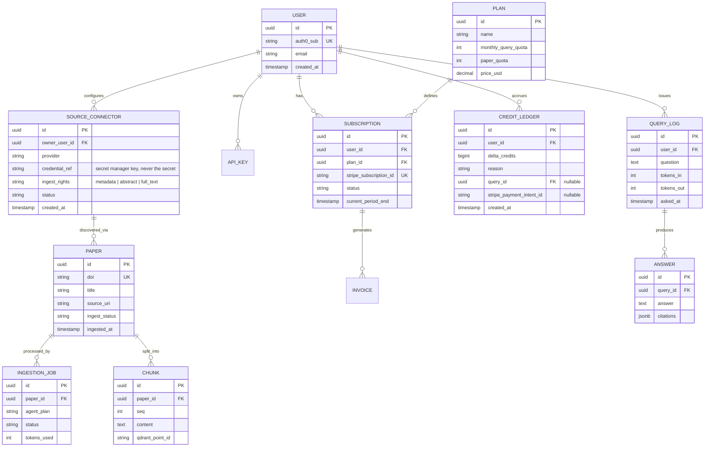

### 5.2 Neo4j — knowledge graph

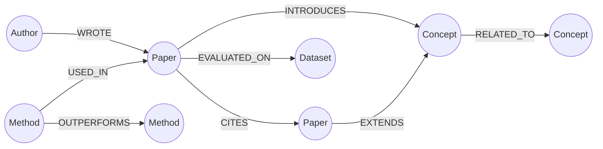

Node labels: `Paper`, `Author`, `Concept`, `Method`, `Dataset`. Relationships carry provenance (`extracted_by`, `confidence`, `source_chunk_id`) so graph answers cite back to PostgreSQL chunks.

### 5.3 Qdrant — vector store

One collection `chunks` (embedding dim per `text-embedding-3`), payload: `paper_id`, `chunk_seq`, `section`. Point IDs mirrored in `CHUNK.qdrant_point_id` for cross-store consistency.

### 5.4 Cross-store consistency

PostgreSQL is authoritative. Ingestion writes PG first (job + chunks), then Neo4j/Qdrant; a reconciliation sweep re-drives failed writes from `INGESTION_JOB.status` (no distributed transactions — idempotent upserts keyed by stable IDs).

---

## 6. Agent & LLM Orchestration (Embabel)

### 6.1 Ingestion flow

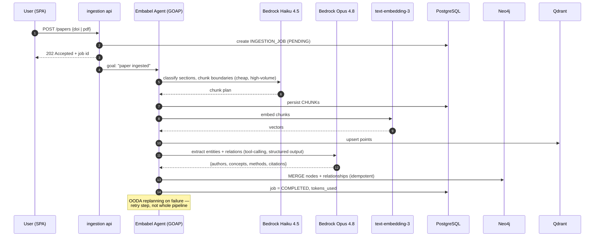

The sequence above shows the on-demand path; since ingestion is already asynchronous (`202 Accepted`), steps 5–11 can run through Bedrock **batch inference** at 50% token cost — see §11.1.

### 6.2 Answering flow (hybrid retrieval)

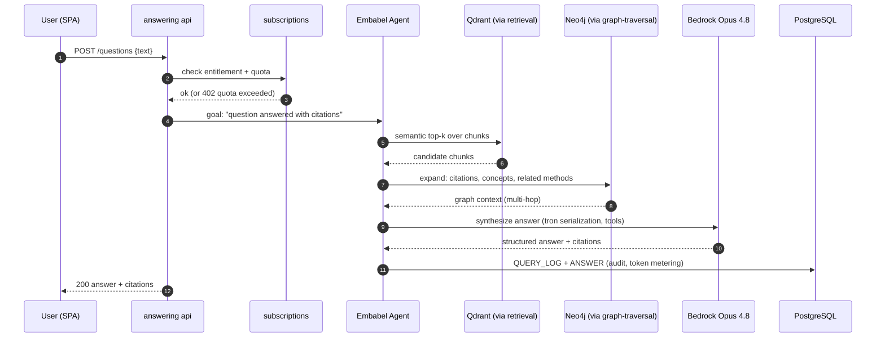

Agent chooses per-step models: Haiku for query classification/rewriting, Opus for planning and synthesis. Token usage is metered into `QUERY_LOG` and drives quota enforcement in `subscriptions`.

### 6.3 Discovery & source connectors (BYOL)

Federated paper search that feeds the corpus. Two connector classes behind one `PaperDiscoveryPort`:

- **Open sources** (all tiers): OpenAlex, Semantic Scholar, arXiv, CrossRef, PubMed — stable, legal, structured APIs that return DOIs, authors, abstracts, and citation links (which slot directly into the Neo4j schema). Deliberately *not* scraping-based metasearch (SearXNG-style): scraped engines mean rate limits, markup breakage, and ToS risk — a poor foundation for a paid product.
- **Licensed sources — bring-your-own-license** (Lab/Enterprise): Scopus, Embase, IEEE, Springer, Wiley, Web of Science. The customer supplies their own API credentials; content enters *their* corpus under *their* license. The platform never relicenses or redistributes publisher content.

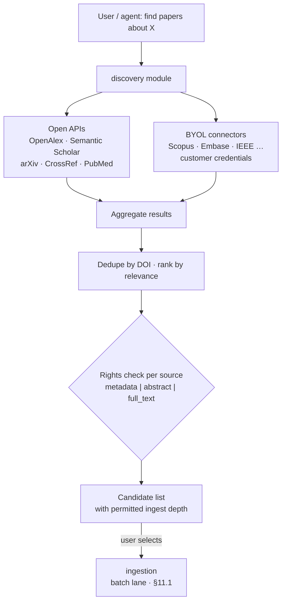

Design rules:

- **TDM rights enforced per connector:** a publisher license often covers *reading* but not *text-and-data-mining*; embedding full text into Qdrant/Neo4j is TDM. `SOURCE_CONNECTOR.ingest_rights` (`metadata` / `abstract` / `full_text`) caps what ingestion may store per source, keeping compliance visibly on the customer's license, not the platform.
- **Credentials in a secret manager**, referenced by key from PostgreSQL — never stored in the database, never logged (aligns with the `no-sensitive-in-logs` gate).
- **Provenance:** every `PAPER` records its `SOURCE_CONNECTOR`, so a revoked license can be traced to affected content.
- **Scale connectors by demand, not breadth:** each connector is permanent maintenance surface (API changes, rate limits, auth quirks). Launch with 2–3 driven by actual customer demand.

#### Enterprise warehouse connectors (Snowflake / Databricks — documents only)

Enterprise customers keep internal research reports, trial summaries, and licensed content in warehouse storage (Snowflake stages, Databricks volumes/Unity Catalog). These are supported as **document sources** — two more `SOURCE_CONNECTOR` providers behind the same `PaperDiscoveryPort`, reading files/rows via their REST/JDBC APIs and feeding the normal ingestion pipeline. Customer credentials, customer's own data: the BYOL pattern applies unchanged (`ingest_rights` typically `full_text` — it's their content).

**Explicit non-goal:** answering over *structured* warehouse data (text-to-SQL insights, "what were our Q3 assay results?"). That is a different product with native incumbents (Databricks Genie, Snowflake Cortex Analyst) and would dilute the cited-literature-answers value proposition. The boundary: if it's a document, H4Graph ingests it wherever it lives; if it's rows, it's out of scope.

---

### 6.4 Answering governance — registered traversals + per-field lineage

Adopted from the Graph Query Agent POC (TotallyWildAi/graph-query-agent): the answering layer is governed by two principles that turn "every answer cited" from a prompt instruction into an enforced mechanism.

**1. Registered traversals, not improvised Cypher.** The agent never generates raw Cypher. Graph access goes through a catalog of **registered, parameterized, read-only query templates** (`citation_chain`, `concept_bridge`, `method_comparisons`, `contradiction_scan`, …). The Embabel agent *plans which templates to run with which parameters* (GOAP fits this exactly — templates are the action space); it does not write queries. When a parameter doesn't resolve (an entity name matches no node), the agent **clarifies rather than guesses** — no partial query runs.

| Benefit | Why it matters here |
|---|---|
| Safety | No injection surface, no runaway traversals; templates carry depth/row limits |
| Testability | Each template is unit- and integration-tested like code (Testcontainers Neo4j, §9) — non-deterministic LLM planning over deterministic retrieval |
| Performance | Templates are profiled and index-backed; caching keys are stable |
| Auditability | A recorded template id + bound params reproduces the exact retrieval |

**2. Per-field lineage, append-only.** The current design audits at answer level (`ANSWER.citations`). This upgrades it: every *value* in an answer records how it was produced — template id + version, bound parameters, node IDs touched, source chunk, graph version — in an append-only lineage store (the application role can only `INSERT`; `UPDATE`/`DELETE` revoked).

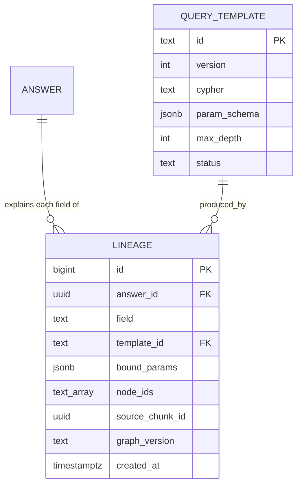

Payoff: any answer is **reproducible from its trace** (template + params + graph version), and a pharma compliance auditor can walk from a sentence in an answer to the exact source passage and query that produced it. This converts the trust story from "the model was told to cite" into "the system cannot emit an untraceable value" — a genuine sales weapon in regulated accounts.

**3. Graph explorer UI (reuse).** The POC's force-layout graph explorer (Sigma.js/WebGL, node provenance panels, searchable autocomplete) is adopted as the corpus-exploration screen in the React SPA — users browse their paper graph visually, and clicking any node shows its provenance block (source, extraction job, graph version). Substantially reduces frontend build for the highest-wow screen in the product.

---

## 7. Integrations, Contracts & Auth

### 7.1 Integration channels (protocol + serialization chosen per channel)

| Channel | Protocol | Serialization | Why |
|---|---|---|---|
| Browser ↔ backend | http | json | Human-readable 5>4, schema evolution; SPA fit |
| Agents ↔ LLM | https | **tron** | Speed 5>4 vs toon; token-efficient agent traffic |
| Backend ↔ Stripe | https | json | Request-response fit, readable, evolvable |
| Backend ↔ Auth0 | https | json | Same |

### 7.2 Contracts (first-class boundaries)

| Boundary | Source of truth | Generated | Verified by | When |
|---|---|---|---|---|
| backend → frontend | OpenAPI spec / annotated controllers | code-first (springdoc) or spec-first (openapi-generator) | Pact / Spring Cloud Contract | pre-merge CI + on provider change |
| frontend → human | Design system + Gherkin acceptance criteria + Storybook | hand-authored from UX | Playwright/Cypress e2e + Storybook interaction + axe a11y | pre-merge CI: e2e + visual regression + a11y |

### 7.3 Auth per surface

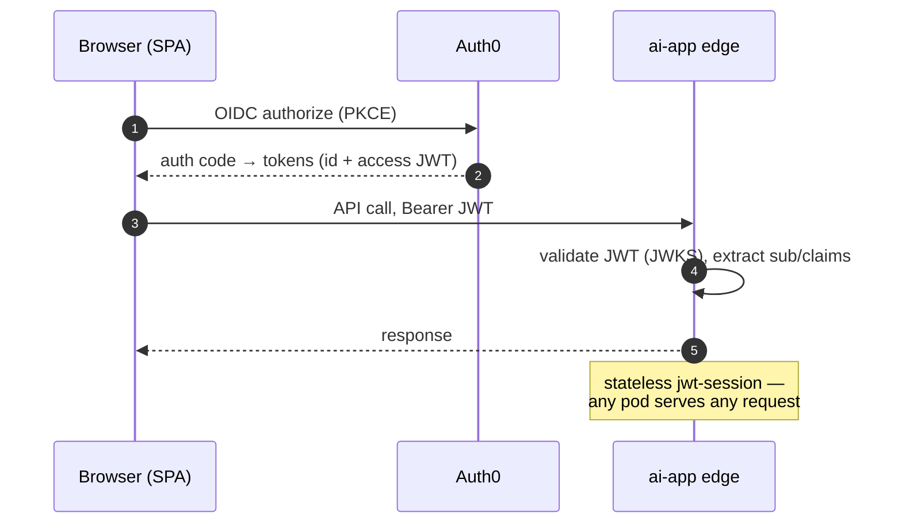

| Surface | Scheme |
|---|---|
| Users | OAuth2/OIDC via Auth0 (login + SSO) |
| 3rd-party API consumers | API key (static secret per integration) |
| Internal sessions | Stateless JWT after login |

Requests are authenticated at the app edge — JWT validated before routing. mTLS deliberately not used for human login (it's service identity).

### 7.4 Public API & customer integration surface

The BFF serves the SPA and evolves with the UI; customer integrations need a **separate, versioned public API** that stays stable regardless of frontend changes. Both are thin in-adapters over the same module `api/` services — no duplicated logic.

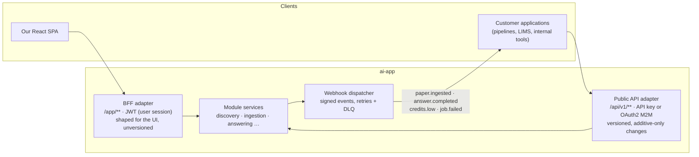

| Concern | Design |
|---|---|
| Surface | `/api/v1/**` — papers (submit/status), discovery search, questions/answers, corpus export. Versioned in the path; v1 changes are additive-only, breaking changes mean `/v2` + deprecation window |
| Contract & SDKs | The OpenAPI spec (§7.2) is the source of truth; TypeScript/Python/Java clients generated via openapi-generator and published — integration cost for the customer is `npm/pip install`, not reading docs |
| AuthN | API keys per integration (already in §7.3) for simple cases; **OAuth2 client-credentials via Auth0** for enterprise M2M — scoped tokens (`papers:write`, `questions:ask`, `corpus:read`) |
| Webhooks | Essential, not optional: batch ingestion (§11.1) completes in hours, so customers get signed webhooks (`paper.ingested`, `answer.completed`, `job.failed`, `credits.low`) instead of polling. HMAC-signed payloads, exponential-backoff retries, dead-letter after N failures |
| Rate limiting & metering | Per-key limits tied to tier; usage flows into the same `QUERY_LOG`/credit metering as the UI — one quota system across both surfaces |
| Idempotency | `Idempotency-Key` header on all mutating endpoints (paper submission, question asking) — safe retries for customer pipelines |
| Contract testing | Pact provider verification covers `/api/v1` exactly as it does the BFF (§7.2) — the public surface is pinned pre-merge |

This also completes the Enterprise tier story: BYOL connectors bring licensed content *in* (§6.3), the public API lets cited answers flow *out* into the customer's own applications.

### 7.5 Subscription & payment flow

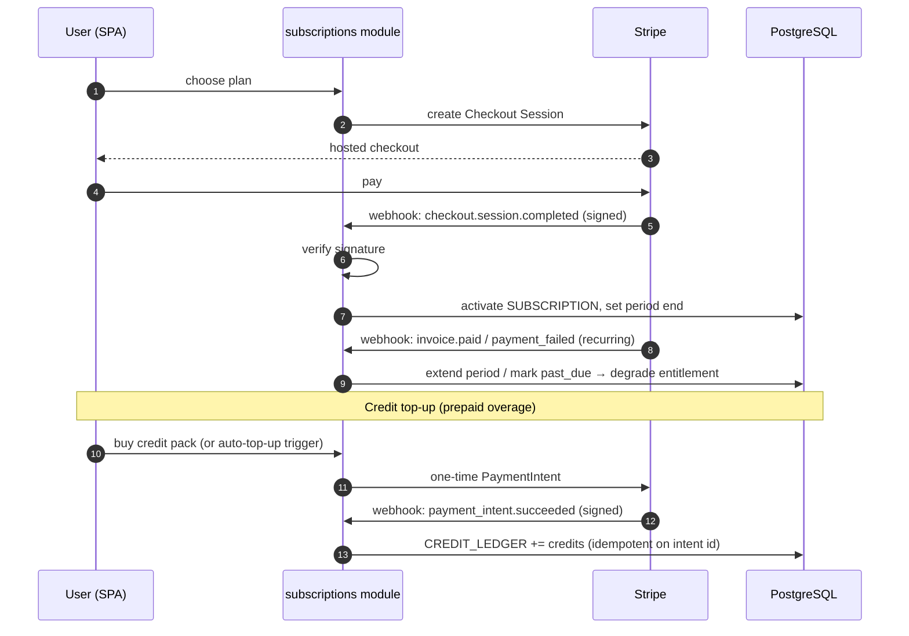

---

## 8. Deployment & Operations

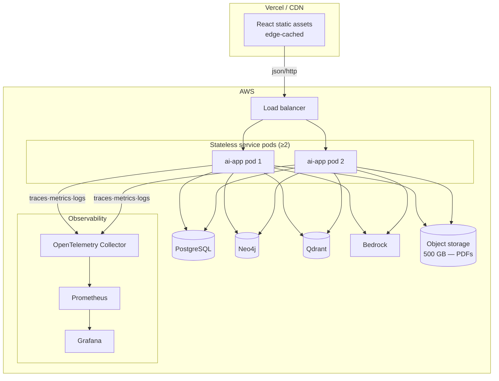

**Operational practices**

- **Stateless service:** no per-request state in instances; any pod serves any request (JWT sessions make this trivial).
- **Probes:** `/health` (liveness) + `/ready` (readiness) so the orchestrator routes only to ready pods.
- **Graceful shutdown:** drain in-flight requests on SIGTERM.
- **Observability:** OpenTelemetry traces + metrics + logs → Prometheus/Grafana.
- **Alerts:** p99 latency, error rate, saturation, SLO burn — chosen because they predict user-facing failure earliest.

AWS chosen over fly.io (scalability 5>3, reliability 5>4, global reach 5>4), GCP/Azure (reliability 5>4); Vercel and Cloudflare Workers ruled out for the service — no JVM support (Vercel still hosts the static UI).

---

## 9. Test Strategy

| Strategy | Tool | When |
|---|---|---|
| Unit + mocking | Mockito (backend), Vitest (frontend) | Always — base of the pyramid |
| Contract testing | Pact | Every service boundary + 3rd-party API |
| Integration over real infra | Testcontainers (PostgreSQL, Neo4j, Qdrant) | No mocks — real stores in CI |
| Agent simulation | WireMock + recorded fixtures | Agentic flows with non-deterministic LLM deps |
| E2E / a11y | Playwright or Cypress + axe + Storybook interaction | Pre-merge |

Development discipline: TDD red-green-refactor per behaviour unit; scoped tests while iterating, full suite at milestones; never start the next unit on a red build; investigate before coding on any failure; exemplar-then-bulk for repetitive artifact families; log failed fix attempts so no approach is retried verbatim.

---

## 10. Implementation Plan

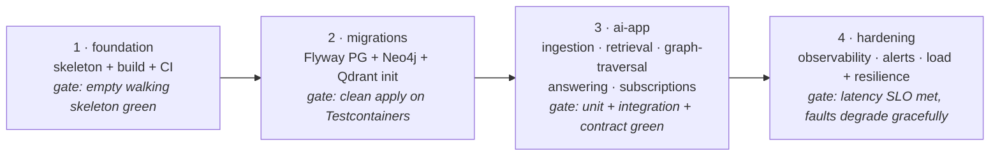

Every step is gated; the CI pipeline is the rolling signal. The exemplar module (per the module blueprint) is built end-to-end first — pom → Flyway migration → RED unit test → domain model + port + service (GREEN) → RED Testcontainers IT → JPA adapter (GREEN) → RED controller slice test → DTOs + controller (GREEN) → contract verification → externalized config — then the pattern is replicated in bulk across the remaining modules.

**Quality gates by phase:** dependency-tree/config/compatibility checks at scaffold; compile + tests-green + no-sensitive-in-logs per work unit; integration-verify + acceptance-criteria at wiring; full suite + coverage at pre-merge and release.

---

## 11. Cost Model

Graph-priced estimate, 1 deployable component, as of 2026-07-01.

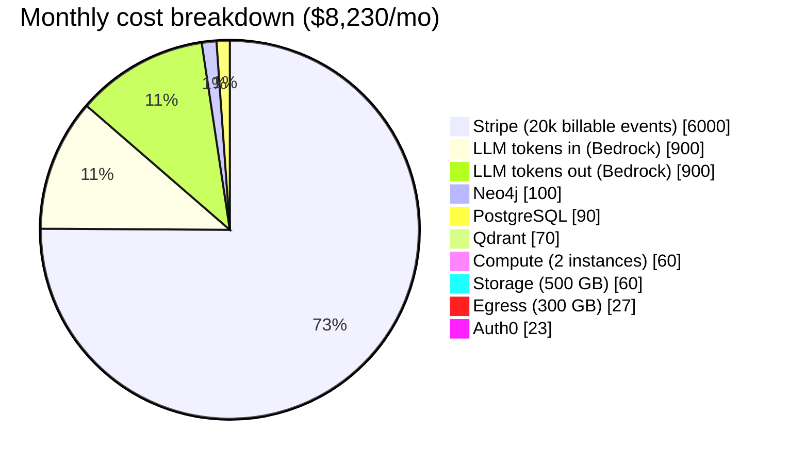

| Item | Basis | $/mo |
|---|---|---|
| Compute | 2 instance-months, AWS | 60.00 |
| Egress | 300 GB | 27.00 |
| PostgreSQL | managed | 90.00 |
| Neo4j | managed | 100.00 |
| Qdrant | managed | 70.00 |
| Storage | 500 GB | 60.00 |
| LLM tokens in | Bedrock | 900.00 |
| LLM tokens out | Bedrock | 900.00 |
| Stripe | 20,000 billable events | 6,000.00 |
| Auth0 | subscription | 23.00 |
| **Total** | | **8,230.00/mo · $98,760/yr** |

### Cost structure analysis

| Bucket | $/mo | Behaviour |
|---|---|---|
| Fixed infrastructure (compute, stores, storage, egress, Auth0) | 430 | Flat until scale forces bigger instances |
| Variable — LLM tokens | 1,800 | Scales with ingestion + query volume; per-user marginal cost |
| Variable — Stripe | 6,000 | Scales with **revenue** (≈2.9% + 30¢/event); a cost of revenue, not infrastructure |

Only **$2,230/mo** is true operating cost; Stripe fees exist only when revenue does. Cost levers, in order of impact: batch inference for ingestion (§11.1), Haiku-first routing (≈1/20 the Opus price), prompt caching on Bedrock, and annual billing to cut Stripe event count.

### 11.1 Batch inference for ingestion (−50% on batchable tokens)

Bedrock batch mode processes JSONL prompt files from S3 asynchronously (results within ≤24h) at **50% of on-demand token price**, and supports the Claude family. The architecture is already shaped for it: ingestion returns `202 Accepted` with a job id — the user never waits synchronously — so the entire ingestion lane (chunk classification, entity/relation extraction, embeddings backfill) can run batched. Only the interactive answering path must stay on-demand.

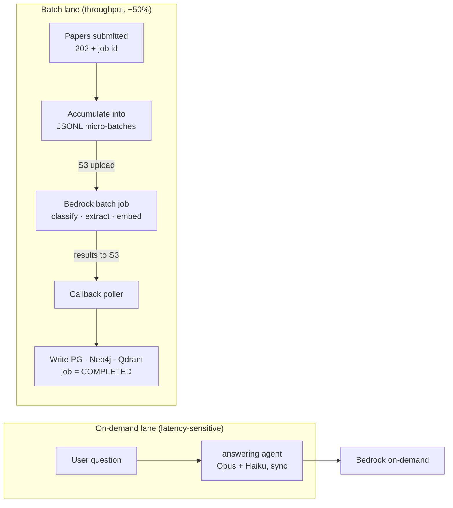

| Token workload | Lane | Share of $1,800 (est.) | After batching |
|---|---|---|---|
| Ingestion: extraction (Opus) + classification (Haiku) | batch | ~$900 | ~$450 |
| Embeddings (ingestion + backfills) | batch | ~$180 | ~$90 |
| Answering (interactive) | on-demand | ~$720 | ~$720 |
| **Total LLM** | | **$1,800** | **≈$1,260 (−30%)** |

Design implications: batch jobs are a second out-adapter behind the same LLM port (no domain change); `INGESTION_JOB` gains states `BATCH_QUEUED → BATCH_SUBMITTED → COMPLETED`; SLA becomes "papers searchable within hours, not seconds" — acceptable for a corpus product, and worth stating in the tier descriptions. Offer a premium "priority ingestion" toggle (on-demand lane) on Lab/Enterprise if some customers need fast turnaround — a cost lever turned into an upsell.

---

## 12. Business Model

Subscription SaaS (the `subscriptions` module is a first-class capability, not an afterthought).

### 12.1 Tiers (illustrative pricing)

| Tier | Price | Papers | Queries/mo | Target |
|---|---|---|---|---|
| Free | $0 | 10 | 25 | Trial / acquisition funnel |
| Researcher | $29/mo | 200 | 500 · open connectors | Individual academics |
| Lab | $99/mo | 2,000 | 3,000 · 5 seats · BYOL connectors | Research groups |
| Enterprise | from $499/mo | unlimited | custom · SSO · API keys · full BYOL catalog | Pharma, R&D orgs |

The BYOL connector catalog (§6.3) is a natural tier gate with near-zero marginal cost: open scholarly sources on every paid tier, licensed-source connectors (Scopus, Embase, IEEE…) reserved for Lab/Enterprise — the segment that already holds those licenses.

Quotas are enforced by the `subscriptions` module from metered `QUERY_LOG` / `INGESTION_JOB` token counts — the same data that drives the cost model, so margin per user is observable in Grafana.

### 12.1a Prepaid credits for overage (LLM cost containment)

Each tier includes a reasonable monthly usage quota; usage beyond it draws from **prepaid credits** rather than postpaid overage billing. This makes runaway LLM cost structurally impossible — spend beyond quota can only occur against cash already collected.

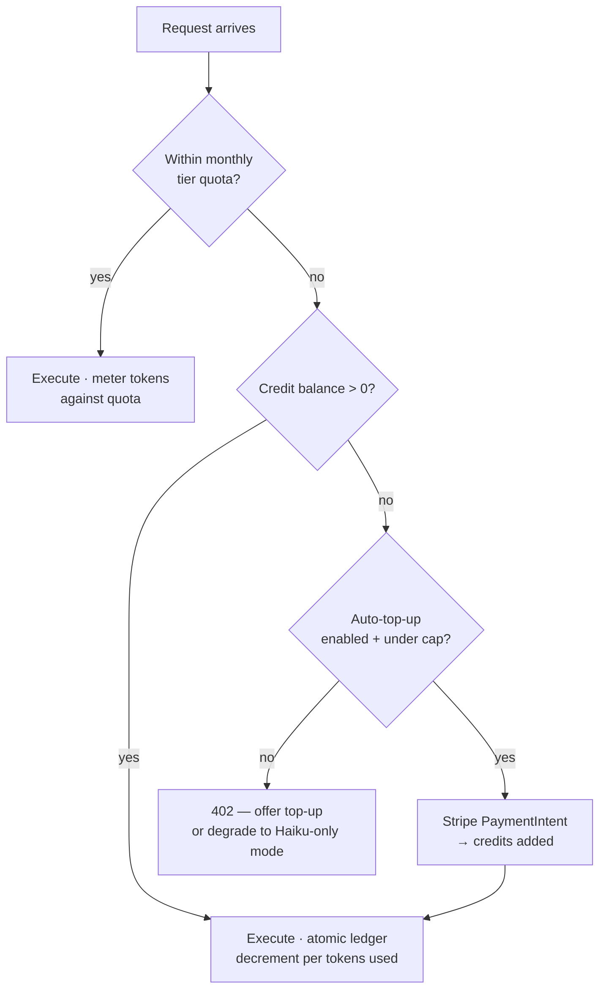

Design rules:

- **Ledger, not counter:** `CREDIT_LEDGER` is append-only (purchases +, consumption −, expiry/refund −); balance is the sum, decrements are atomic with token metering in the same PG transaction as `QUERY_LOG`. Auditable, race-free across stateless pods.
- **Credits denominated in platform units** (e.g., 1 credit ≈ 1k blended tokens), not dollars — insulates pricing from per-model Bedrock rate changes and lets Haiku-routed work cost fewer credits than Opus work.
- **Auto-top-up with user-set cap** avoids mid-task interruptions; hard stop (or free Haiku-only degraded mode) when balance is exhausted and auto-top-up is off — never silent negative balances.
- **Priced above marginal cost** (e.g., ~2–3× blended token cost) so overage is margin-positive, not just cost recovery.
- **Accounting note:** unconsumed credits are deferred revenue until burned; breakage (expired credits, e.g., 12-month validity) recognizes as revenue on expiry.

Why not the alternatives: postpaid overage creates surprise-bill churn and collection risk on the least profitable users; a hard cutoff alone alienates power users — the segment most willing to pay more.

#### Credit pack pricing (illustrative)

1 credit ≈ 1k blended tokens; post-batching marginal cost ≈ $0.005/credit; base price $0.015/credit (3× cost). Volume incentive is paid in **bonus credits, not price cuts** — the headline unit price never erodes, larger packs pull more cash forward, and unused bonus credits expire into breakage revenue.

| Pack | Price | Credits | Bonus | Effective $/credit | Target |
|---|---|---|---|---|---|
| Boost | $25 | 1,650 | — | $0.0152 | Occasional overage |
| Standard | $100 | 6,650 | +5% | $0.0143 | Regular Researcher/Lab top-ups |
| Bulk | $500 | 33,300 | +15% | $0.0131 | Heavy Lab users |
| Volume | $2,000 | 133,300 | +25% | $0.0120 | Power teams — the pre-pay target |
| Enterprise commit | annual, invoiced | custom | +30–40% | negotiated | Committed-use deal: cash up front, invoiced outside Stripe (also cuts payment fees) |

Rules: credits valid 12 months from purchase (drives breakage + revenue recognition); even the largest bonus keeps effective price ≥2.4× marginal cost, so overage is margin-positive at every volume; Enterprise commits convert the heaviest usage into upfront annual cash — the SaaS equivalent of cloud committed-use discounts.

Guardrail: tier quotas should stay generous enough that typical users rarely touch credits. Credits monetize spikes and power usage; if median users hit the credit wall monthly, that's a mispriced tier, and it will read as a hidden tax.

### 12.2 Unit economics (illustrative, at spec volumes)

Assume the $1,800/mo LLM budget supports ≈600 active paying users at typical usage (blend of Haiku-heavy ingestion and Opus answering):

| Metric | Value |
|---|---|
| Marginal LLM cost / active user | ≈ $3.00/mo |
| Fixed infra / user @ 600 users | ≈ $0.72/mo |
| Blended ARPU (60% Researcher, 35% Lab, 5% Enterprise) | ≈ $77/mo |
| Payment cost (≈2.9% + 30¢) | ≈ $2.50/user/mo |
| **Contribution margin / user** | **≈ $70/mo (≈91%)** |

### 12.3 Break-even

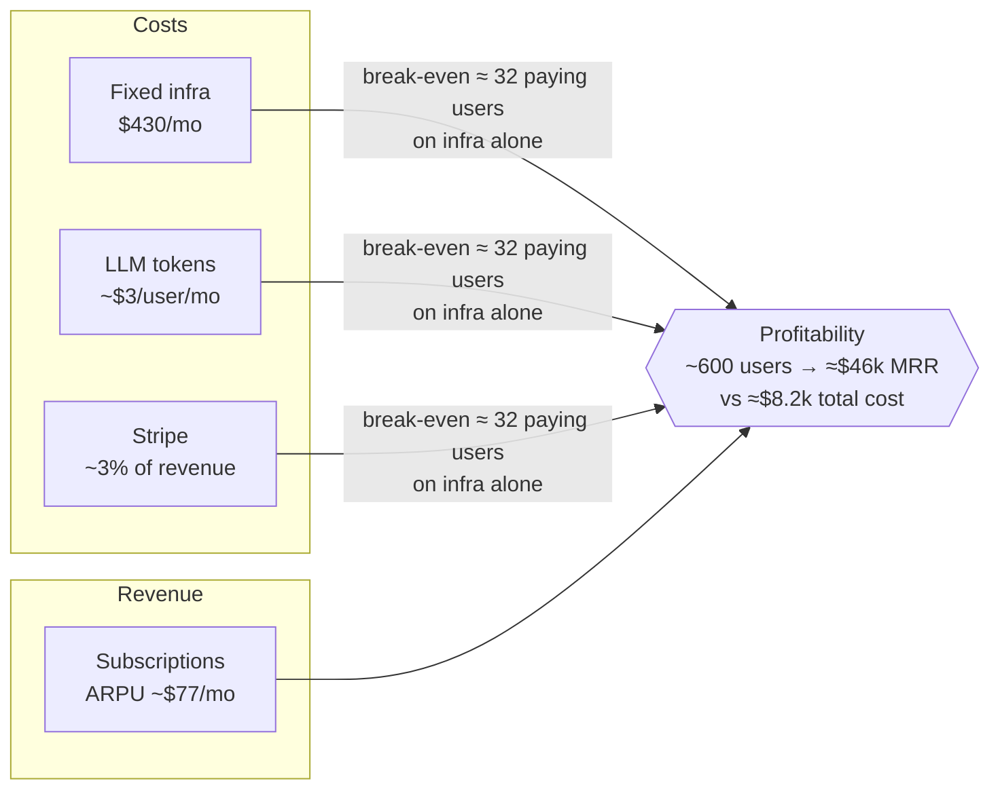

Infrastructure break-even sits near **32 paying users** (fixed $430 + marginal costs vs ~$74 net ARPU). At the spec's modeled volume (~600 users, ≈$46k MRR), total cost of $8.2k/mo yields ~82% gross margin. The dominant scaling risk is LLM spend per power user — mitigated by per-tier token quotas, Haiku routing, and prompt caching.

### 12.4 Growth levers

Free tier feeds the funnel (10 papers is enough to demonstrate graph answers); Lab tier monetizes collaboration; Enterprise adds API-key access (already designed into the auth model) for programmatic ingestion pipelines. Annual billing improves cash flow and cuts Stripe per-event fees.

---

## 13. Risks & Mitigations

| Risk | Impact | Mitigation |
|---|---|---|
| LLM cost blow-up from power users | Margin erosion | Prepaid credits for all overage (spend capped by collected cash), per-tier quotas, Haiku-first routing, prompt caching |
| Cross-store drift (PG/Neo4j/Qdrant) | Wrong answers | PG-authoritative writes, idempotent upserts, reconciliation sweep |
| Non-deterministic agent behaviour | Flaky UX/tests | Embabel structured output, WireMock recorded fixtures, OODA bounded retries; registered traversal templates (§6.4) make retrieval deterministic — only planning stays probabilistic |
| Untraceable answer content | Trust/compliance failure in regulated accounts | Per-field append-only lineage (§6.4): the system cannot emit an untraceable value |
| Vendor lock-in (Bedrock, Auth0, Stripe) | Switching cost | Ports/adapters isolate all three behind domain interfaces |
| Batch ingestion SLA (≤24h) surprises users | Perceived slowness | State "searchable within hours" in tier copy; priority (on-demand) ingestion as Lab/Enterprise upsell |
| TDM violation via licensed connectors | Publisher legal action against customer or platform | BYOL model (customer's license, customer's credentials) + per-source `ingest_rights` enforcement + provenance on every paper |
| Connector maintenance sprawl | Engineering drag | Demand-driven catalog (2–3 at launch), one adapter pattern behind `PaperDiscoveryPort`, contract tests per connector |
| Monolith scaling ceiling | Latency at growth | Module boundaries are extraction-ready; stateless pods scale horizontally first |

---

*Architecture conformance: ✓ schema-valid. All selections trace to the decision graph in the source specification.*
